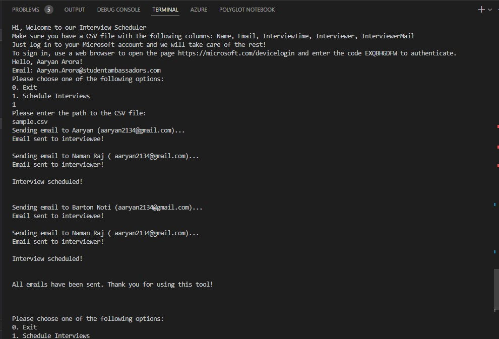
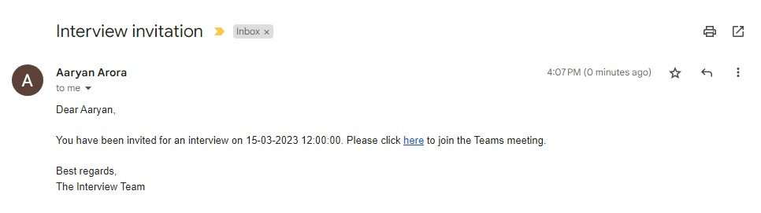
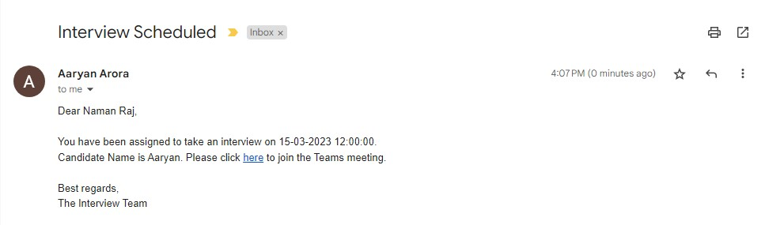
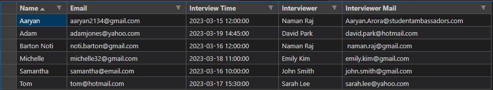

# Interview Scheduler

### Description

This project is an automated tool for recruiters to schedule interviews on teams.

### What it does?
1. Automatically creates a teams meeting link for the specified time and day.
2. Reads a CSV file to collect all the input parameters like Name, email ID, Time of Interview, Interviewer Details etc
3. Sends an email notification to both the interviewer and interviewee with the Teams Meeting Link and the Time & Day of the Interview

### What the recruiter needs to do?
1. Provide a CSV with basic details like name, email ID, time of interview, Interviewer details
2. Just use the App and notify everyone instantly!

### How it is built?
1. .Net
2. Microsoft Graph to create Teams Meeting Link and send an email from your outlook account
3. Console App to do this all interactively

### How to use it?
1. Clone the repo
2. Create a new app in Azure Active Directory and get the Client ID
3. Update the Client ID in the appsettings.json file
4. Update the CSV file with the details of the interviewees
5. Run the command `dotnet run` in the terminal
6. Follow the instructions on the screen
7. Have fun!

Now, recruiters can easily inform about the interviews using personalized emails without having the need to do it themselves!

### Screenshots

 
 

 
 

 
 

 
 

 
 
